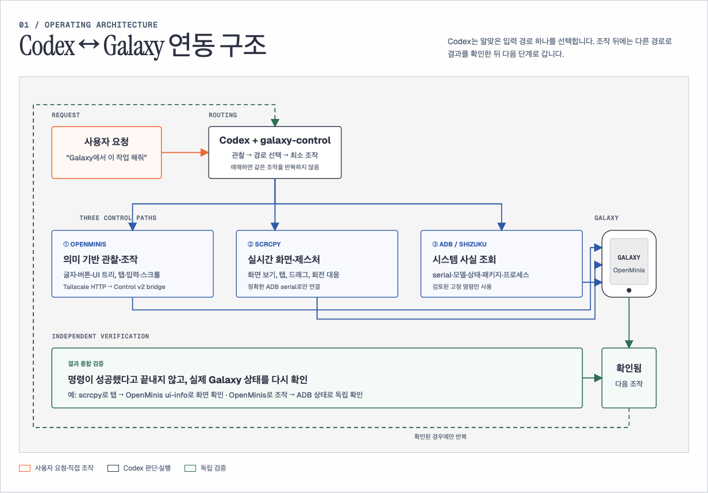
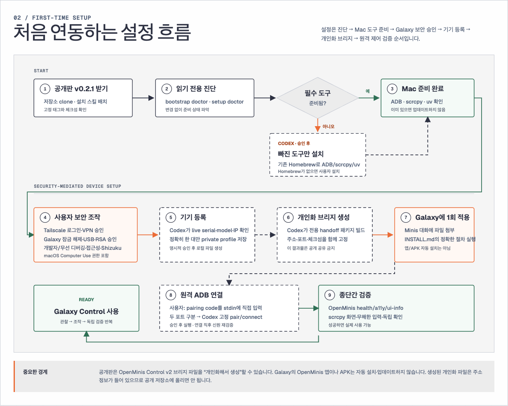
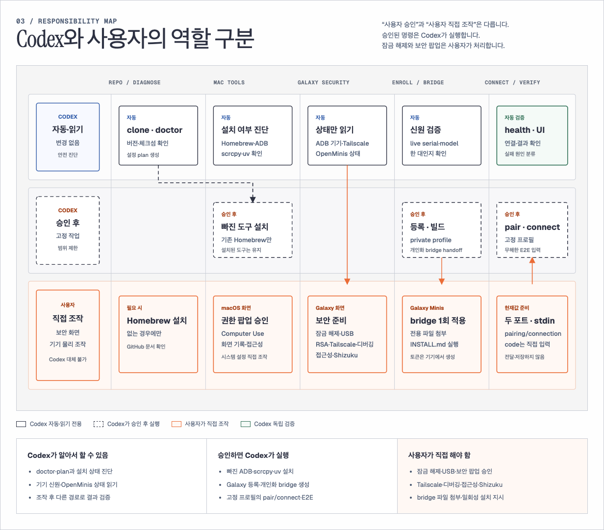

# Galaxy Control for Codex

macOS의 Codex가 Samsung Galaxy를 **관찰 → 최소 조작 → 독립 검증** 순서로 다루도록 만든
배포용 스킬입니다.

```text
사용자 요청
   ↓
Codex + galaxy-control
   ├─ OpenMinis ─ 의미·글자·버튼 관찰과 반복 가능한 조작
   ├─ scrcpy ──── 실시간 화면, 드래그, 회전, 복합 제스처
   └─ ADB/Shizuku ─ 기기 신원·연결·시스템 사실
   ↓
다른 적절한 경로로 결과 확인 후 다음 단계
```

## 한눈에 보는 연동 구조

### 1. Codex와 Galaxy가 동작하는 흐름



### 2. 처음 연결하는 흐름



### 3. Codex와 사용자가 맡는 단계



그림은 역할과 순서를 설명하는 일반화 자료입니다. 실제 기기 serial, IP, 토큰, 페어링
코드는 포함하지 않습니다. 페어링 포트와 연결 포트는 서로 다른 현재값이며, 6자리 페어링
코드는 사용자가 ADB의 표준 입력에 직접 입력하고 채팅·파일·로그에 남기지 않습니다.

## 지원 범위

- macOS
- Samsung Galaxy 한 대
- Codex desktop와 필요한 Computer Use 권한
- Galaxy에 설치된 OpenMinis와 이 저장소에서 생성하는 OpenMinis Control v2 로컬 브리지
- Tailscale을 통한 기기 간 연결
- ADB와 scrcpy
- Android 공식 Wireless Debugging

OpenMinis 앱이나 APK 설치·업데이트는 이 배포판이 수행하지 않습니다. 대신 일반 OpenMinis
앱만으로는 제공되지 않는 Control v2 브리지 소스와 개인화 설치 파일 생성기를 포함합니다.
Galaxy 재부팅 후 완전
무인 복구도 지원하지 않으며, Android가 요구하는 잠금 해제와 보안 설정은 사용자가 직접
확인해야 합니다.

## 설치

공개 릴리스 태그를 고정해 내려받습니다.

```sh
git clone --depth 1 --branch v0.4.0 https://github.com/BUGGIEEEEE/galaxy-control.git
cd galaxy-control
python3 scripts/install_skill.py --approved
```

설치기는 기존 `galaxy-control` 스킬을 덮어쓰지 않습니다. 이미 설치되어 있으면 중단하므로
기존 스킬의 백업·교체 여부를 사용자가 먼저 결정해야 합니다. 설치 뒤 Codex를 새로 열고
`$galaxy-control`을 호출합니다.

### 이미 v0.1.x 스킬이 설치된 사용자

기존 스킬을 삭제·이동·덮어쓰지 않아도 브리지 준비를 먼저 진행할 수 있습니다. `v0.4.0`
저장소를 별도 폴더에 내려받고, 아래처럼 **체크아웃 안의 배포용 스킬 경로**를 사용합니다.

```sh
git clone --depth 1 --branch v0.4.0 https://github.com/BUGGIEEEEE/galaxy-control.git galaxy-control-v0.4.0
cd galaxy-control-v0.4.0
BRIDGE_RELEASE_ROOT="$PWD/skill/galaxy-control"

uv run "$BRIDGE_RELEASE_ROOT/scripts/galaxy_bridge_package.py" doctor
uv run "$BRIDGE_RELEASE_ROOT/scripts/galaxy_bridge_package.py" \
  build --output "$HOME/Desktop/openminis-control-v2-handoff" --approved
```

이 명령은 기존에 설치된 `~/.codex/skills/galaxy-control`을 수정하지 않습니다. 등록 프로필은
기존 Application Support 위치에서 읽고, 새 개인화 인계 폴더만 만듭니다. 브리지 E2E 확인 후
스킬 자체를 `v0.4.0`로 교체할지는 별도 작업으로 결정하세요. 설치기는 의도적으로 자동
업그레이드하지 않습니다.

`uv`가 없는 새 Mac은 저장소 안의 표준 Python 부트스트랩으로 먼저 확인합니다.

```sh
python3 scripts/bootstrap.py doctor
python3 scripts/bootstrap.py apply --approved
```

두 번째 명령은 `uv`가 없고 Homebrew가 있을 때만 정확히 `brew install uv`를 실행합니다.
Homebrew도 없으면 자동 설치하지 않고 사용자가 Homebrew 또는 uv를 설치하도록 중단합니다.

## 최초 환경 구성

먼저 읽기 전용 진단과 계획만 실행합니다.

```sh
GALAXY_SKILL_ROOT="${CODEX_HOME:-$HOME/.codex}/skills/galaxy-control"
uv run "$GALAXY_SKILL_ROOT/scripts/galaxy_setup.py" doctor
uv run "$GALAXY_SKILL_ROOT/scripts/galaxy_setup.py" plan
```

계획에 표시된 Homebrew 명령을 확인한 뒤에만 다음을 실행합니다.

```sh
uv run "$GALAXY_SKILL_ROOT/scripts/galaxy_setup.py" apply --approved
```

자동 설치 대상은 **현재 없는** ADB, scrcpy, `uv`뿐입니다. 이미 있는 도구는 업데이트하지
않습니다. Tailscale 설치·로그인/VPN 승인, macOS 개인정보 보호 창, Galaxy 잠금 해제,
ADB 신뢰, Wireless Debugging, Accessibility와 Shizuku 권한은 보안상 사용자가 진행합니다.

Galaxy 한 대를 USB로 연결하고 잠금 해제한 뒤 등록합니다.

```sh
uv run "$GALAXY_SKILL_ROOT/scripts/galaxy_setup.py" enroll --approved
uv run "$GALAXY_SKILL_ROOT/scripts/galaxy_doctor.py" openminis
uv run "$GALAXY_SKILL_ROOT/scripts/galaxy_doctor.py" adb
uv run "$GALAXY_SKILL_ROOT/scripts/galaxy_doctor.py" scrcpy
```

두 대 이상이면 doctor의 현재 목록에서 정확한 대상을 고른 뒤
`enroll --serial LIVE_SERIAL --approved`를 사용합니다. 등록 정보는 Git 저장소가 아니라
사용자 전용 Application Support 파일에 비공개 권한으로 저장됩니다.

## OpenMinis Control v2 브리지 준비

일반 OpenMinis 앱이 설치되어 있어도 포트 `43129`의 Control v2 브리지는 별도로 준비해야
합니다. 공개 소스 파일의 IP를 직접 수정하지 않습니다. 상대방 Codex가 아래 세 값을 자동으로
확인해 **그 사용자에게만 맞는 설치 파일**을 Mac에서 생성합니다.

| 값 | 어디서 읽는가 | 어디에 채워지는가 |
| --- | --- | --- |
| Galaxy Tailscale IPv4 | `enroll`이 만든 비공개 기기 프로필 | 생성된 설치 파일 → Galaxy의 비공개 `bridge.json` |
| Mac Tailscale IPv4 | Mac의 `tailscale ip -4` 실시간 결과 | 생성된 설치 파일 → Galaxy의 비공개 `bridge.json` |
| 포트 | 비공개 프로필의 `openminis_port` | 기본값 `43129`; 생성된 설치 파일과 `bridge.json` |

먼저 값과 공개 브리지 자산을 읽기 전용으로 검사합니다.

```sh
uv run "$GALAXY_SKILL_ROOT/scripts/galaxy_bridge_package.py" doctor
```

`READY`이면 비어 있는 절대 경로 하나를 골라 개인화 인계 묶음을 만듭니다.

```sh
uv run "$GALAXY_SKILL_ROOT/scripts/galaxy_bridge_package.py" \
  build --output "$HOME/Desktop/openminis-control-v2-handoff" --approved
```

생성 폴더에는 다음 네 종류만 있습니다.

- `openminis-control-v2-<SHA256>.py`: 해당 Galaxy/Mac 조합 전용 설치 파일
- `INSTALL.md`: Minis에게 파일을 첨부한 뒤 정확히 한 번 실행시킬 지시문
- `LIFECYCLE.md`: `status`, `start`, `stop` 고정 명령
- `SHA256SUMS`: 설치 파일과 포함된 런타임 manifest 확인값

상대방 Codex는 `INSTALL.md`대로 설치한 뒤 `LIFECYCLE.md`의 `status`를 확인하고, Mac에서
다음을 실행해 실제 연결을 검증합니다.

```sh
"$GALAXY_SKILL_ROOT/scripts/galaxy_control.sh" health
"$GALAXY_SKILL_ROOT/scripts/galaxy_control.sh" a11y-status
"$GALAXY_SKILL_ROOT/scripts/galaxy_control.sh" ui-info
```

개인화 설치 파일에는 두 Tailscale 주소가 들어 있으므로 GitHub, 메신저, 공개 이슈에 올리지
않고 대상 Galaxy의 Minis에만 전달합니다. 토큰은 Galaxy에서 설치할 때 새로 생성되며 출력되지
않습니다. 자세한 실패 처리와 원복은
[OpenMinis 브리지 배포 안내](skill/galaxy-control/references/openminis-bridge-distribution.md)를
따릅니다.

## One UI 앱 서랍·폴더 작업

One UI의 폴더 선택기 한 곳만 읽으면 전체 앱 목록이 아닐 수 있습니다. 현재 폴더에 이미 든
앱이 그 선택기에서 숨겨질 수 있기 때문입니다. 이 릴리스는 Galaxy를 조작하지 않고 저장된
자료만 검사하는 두 가지 로컬 검증기를 제공합니다. `replay`와 `union`은 사용자가 지정한
새 Mac 출력 디렉터리만 만들며, `check`는 입력 TSV만 읽습니다. Mac 파일도 쓰면 안 되는
요청에서는 `replay`와 `union`을 실행하지 않습니다.

```sh
# 저장된 ui-dump JSONL을 읽어 한 선택기의 겹치는 구간을 재생
uv run "$GALAXY_SKILL_ROOT/scripts/oneui_inventory.py" replay \
  --input /ABSOLUTE/picker-a.jsonl \
  --output /ABSOLUTE/NEW/picker-a-replay \
  --capture-session CAPTURE_ID \
  --source FOLDER_A

# 같은 시점에 수집한 서로 다른 선택기 둘 이상을 합집합으로 검증
uv run "$GALAXY_SKILL_ROOT/scripts/oneui_inventory.py" union \
  --input /ABSOLUTE/NEW/picker-a-replay/app_selector_inventory.tsv \
  --input /ABSOLUTE/NEW/picker-b-replay/app_selector_inventory.tsv \
  --output /ABSOLUTE/NEW/inventory-union

# 명세·선택 원장·진행 로그·화면의 선택 수를 함께 검증
uv run "$GALAXY_SKILL_ROOT/scripts/oneui_ledger.py" check \
  --manifest /ABSOLUTE/manifest.tsv \
  --ledger /ABSOLUTE/selection-ledger.tsv \
  --progress /ABSOLUTE/progress.tsv \
  --selected-count N
```

핵심 규칙은 간단합니다.

- `N개 선택됨`은 수량만 증명하고, 어떤 앱인지 증명하지 않습니다.
- 선택 원장이 명세와 같고, 원장 행 수가 선택 수와 같아야 합니다.
- 이동 성공은 `목표에 있음 + 소스에서 사라짐 + 예상 개수 일치`로 확인합니다.
- 결과가 애매한 `완료`나 이동은 반복하지 않고 관찰 경로만 바꿉니다.
- 앱 이동 뒤 페이지·좌표·폴더 위치는 다시 읽습니다.
- 동명 앱 하나만 골라야 한다면 좌표가 아니라 패키지·컴포넌트 증거가 필요합니다.

자세한 안전 가드는 [One UI launcher](skill/galaxy-control/references/oneui-launcher.md),
[folder picker](skill/galaxy-control/references/oneui-folder-picker.md),
[verification](skill/galaxy-control/references/verification.md)에 있습니다. 특정 세션의 앱 수,
폴더 이름, 앱 분류, 좌표, 스크롤 거리는 배포 자료에 넣지 않습니다.

## 주요 인터페이스

```sh
# OpenMinis
"$GALAXY_SKILL_ROOT/scripts/galaxy_control.sh" health
"$GALAXY_SKILL_ROOT/scripts/galaxy_control.sh" ui-info

# 사용자별 OpenMinis Control v2 브리지 패키지
uv run "$GALAXY_SKILL_ROOT/scripts/galaxy_bridge_package.py" doctor

# scrcpy
uv run "$GALAXY_SKILL_ROOT/scripts/galaxy_screen.py" view
uv run "$GALAXY_SKILL_ROOT/scripts/galaxy_screen.py" control
uv run "$GALAXY_SKILL_ROOT/scripts/galaxy_screen.py" stop

# ADB 상태와 공식 Wireless Debugging
uv run "$GALAXY_SKILL_ROOT/scripts/galaxy_remote_adb.py" status
uv run "$GALAXY_SKILL_ROOT/scripts/galaxy_remote_adb.py" wireless-status
```

위 One UI 절의 검사기도 임의 옵션을 받지 않는 고정 프로필입니다. 페어링, `adb tcpip`,
네트워크·권한 변경, 재부팅, 전송·결제·삭제는 별도의 명시적 승인이 필요합니다.

## 배포 완성도

- 자동 테스트와 정적·프라이버시 검사 및 일반화 브리지 패키지 검증을 통과한 릴리스:
  `PACKAGE_READY`
- 새로운 사용자의 깨끗한 Mac 설치 확인: `PILOT_INSTALL_VERIFIED`
- 새로운 사용자의 실제 화면·입력·독립 검증까지 확인: `PILOT_E2E_VERIFIED`
- 위 검증과 공개 태그·체크섬까지 모두 확인: `DISTRIBUTION_READY`

코드 테스트만으로 실제 다른 사용자의 Galaxy 제어 성공을 주장하지 않습니다. 상세 설계는
[Master Plan](docs/MASTER_PLAN.md)과 [단계별 계획](docs/plans/)에 있습니다.

## 제거

스킬 디렉터리와 Galaxy Control이 만든 두 로컬 상태 디렉터리만 사용자가 명시적으로
제거할 수 있습니다.

```text
~/.codex/skills/galaxy-control
~/Library/Application Support/galaxy-control
~/Library/Caches/galaxy-control
```

제거는 OpenMinis, Tailscale, Galaxy 데이터, 녹화 출력, ADB 키를 삭제하지 않습니다.
보안 정책과 취약점 제보 방법은 [SECURITY.md](SECURITY.md)를 확인하세요.
